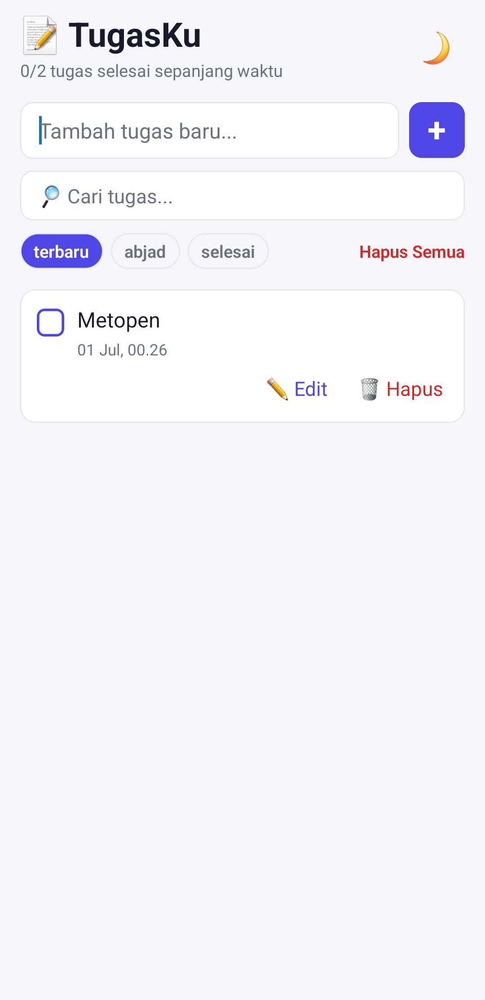
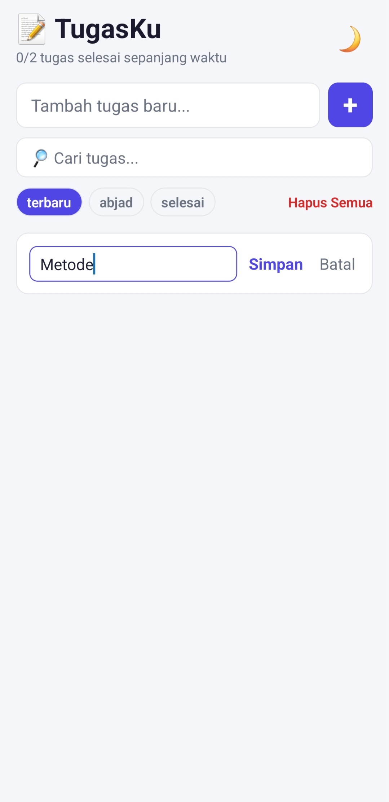
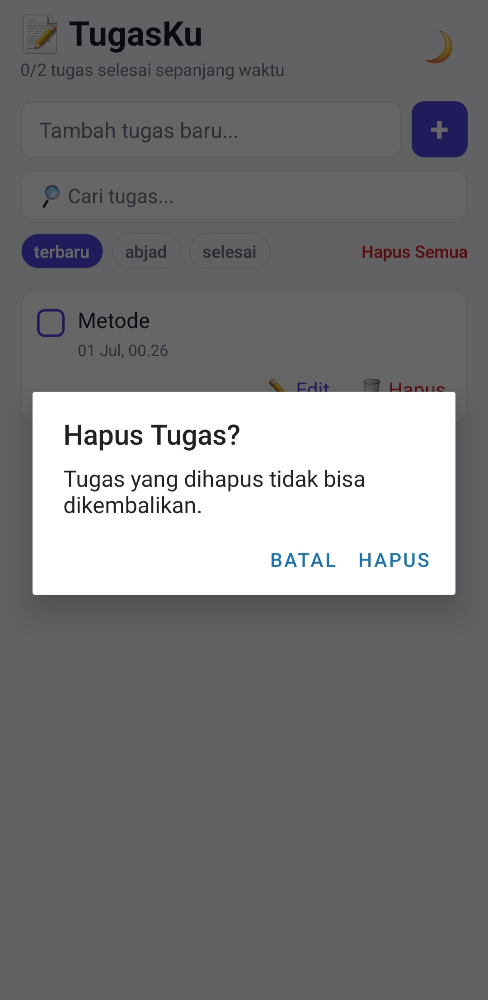
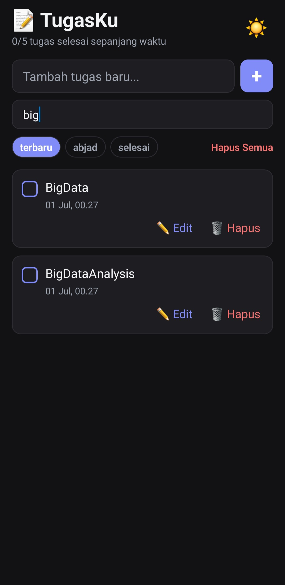

# 📝 NOTE-KEEPER — Persistent To-Do List App

Aplikasi To-Do List dengan persistensi penuh menggunakan **AsyncStorage**, dibangun dengan **React Native (Expo)**.
Dibuat untuk Misi 12: *Build a Persistent App*.

---

## 📋 Deskripsi Aplikasi

NOTE-KEEPER adalah aplikasi daftar tugas (to-do list) di mana semua data tersimpan secara lokal di perangkat menggunakan `AsyncStorage`, sehingga data **tetap ada walau aplikasi ditutup total**.

## ✅ Fitur

### Level 1 — Core (Wajib)
- [x] **CREATE** — tambah tugas baru lewat `TextInput`, validasi menolak input kosong
- [x] **READ** — data dimuat otomatis saat app dibuka (`useEffect`)
- [x] **DELETE** — hapus tugas (filter array + sinkron ke storage)
- [x] Simpan ke `AsyncStorage` dengan `JSON.stringify` setiap data berubah
- [x] `FlatList` dengan `keyExtractor`
- [x] Empty state (`ListEmptyComponent`)
- [x] Persistensi terbukti — data bertahan setelah app ditutup & dibuka lagi

### Level 2 — Pengembangan (dipilih: 5 dari minimal 2)
- [x] ✏️ **Update** — toggle status selesai (dicoret) + edit teks tugas
- [x] 🌙 **Dark Mode** — tema tersimpan di key terpisah (`@tugasku:theme`), dimuat otomatis saat app dibuka
- [x] 🔎 **Search/Filter** — cari tugas berdasarkan teks (filter di memori)
- [x] 📊 **Statistik Tersimpan** — total tugas dibuat & total selesai, disimpan & dimuat dari `AsyncStorage` (key `@tugasku:stats`)
- [x] 🗑️ **Konfirmasi Hapus** — `Alert` konfirmasi sebelum tugas benar-benar dihapus
- [x] 🧹 **Hapus Semua** — tombol untuk membersihkan key tugas saja (tema & statistik tetap tersimpan)

### Level 3 — Bonus
- [x] 📅 **Timestamp** — setiap tugas menyimpan & menampilkan waktu dibuat
- [x] 🔃 **Sorting** — urutkan berdasarkan terbaru / abjad / status selesai

## 🔑 Struktur AsyncStorage

| Key                  | Isi                                      |
|-----------------------|-------------------------------------------|
| `@tugasku:todos`      | Array semua tugas (JSON)                  |
| `@tugasku:theme`      | Boolean mode gelap (JSON)                 |
| `@tugasku:stats`      | Objek `{ totalCreated, totalCompleted }`  |

Pola sinkronisasi yang dipakai di seluruh app:
```
buat array baru → setTodos(arrayBaru) → AsyncStorage.setItem(key, JSON.stringify(arrayBaru))
```
Ini penting karena `setState` di React bersifat asinkron — kita tidak boleh mengandalkan
state lama saat menyimpan ke storage pada baris kode yang sama.

## 🛠️ Tech Stack
- React Native (Expo)
- `@react-native-async-storage/async-storage`
- JavaScript (functional components + hooks: `useState`, `useEffect`, `useMemo`, `useCallback`)

## ▶️ Cara Menjalankan
```bash
# 1. Install dependencies
npm install
npx expo install @react-native-async-storage/async-storage

# 2. Jalankan project
npx expo start

# 3. Scan QR code dengan aplikasi Expo Go di HP fisik
```

## 🔗 Expo Snack
> Tempel kode `App.js` di [snack.expo.dev](https://snack.expo.dev/@vnderbilts/note-keeper), tambahkan dependency
> `@react-native-async-storage/async-storage` di panel Dependencies, lalu copy link Snack-mu di sini:
>
> **Link Expo Snack: `<isi link Snack kamu di sini>`**

## 📱 Bukti Pengujian (4 Test Case + Fitur Level 2)

> Letakkan file screenshot dengan nama persis seperti di bawah ini di dalam folder `screenshots/` —
> gambar akan otomatis tampil sebagai preview di README ini (di GitHub).

### 1️⃣ Create — tambah tugas baru


### 2️⃣ Update — toggle selesai / edit teks


### 3️⃣ Delete — konfirmasi hapus


### 4️⃣ Fitur Level 2 (Dark Mode / Search / Statistik)


**Cara mengambil bukti persistensi:**
1. Buka app, tambahkan beberapa tugas.
2. Screenshot daftar tugas.
3. Tutup app sepenuhnya (swipe dari recent apps, bukan hanya minimize).
4. Buka app lagi.
5. Screenshot — daftar tugas harus sama persis seperti sebelum ditutup.

## 📦 Struktur Folder
```
NOTE-KEEPER/
├── App.js          # seluruh logic & UI aplikasi
├── index.js
├── app.json
├── package.json
├── README.md
└── screenshots/    # screenshot bukti pengujian
```

## 🚀 Riwayat Commit (Conventional Commits)
```bash
git add .
git commit -m "feat: initial CRUD todo app with AsyncStorage"
git commit -m "feat: add toggle complete and edit todo"
git commit -m "feat: add dark mode persistence"
git commit -m "feat: add search and sort"
git commit -m "feat: add stats counter persisted to storage"
git commit -m "feat: add delete confirmation and clear all"
git commit -m "docs: add README with screenshots and snack link"

git push -u origin main
```
